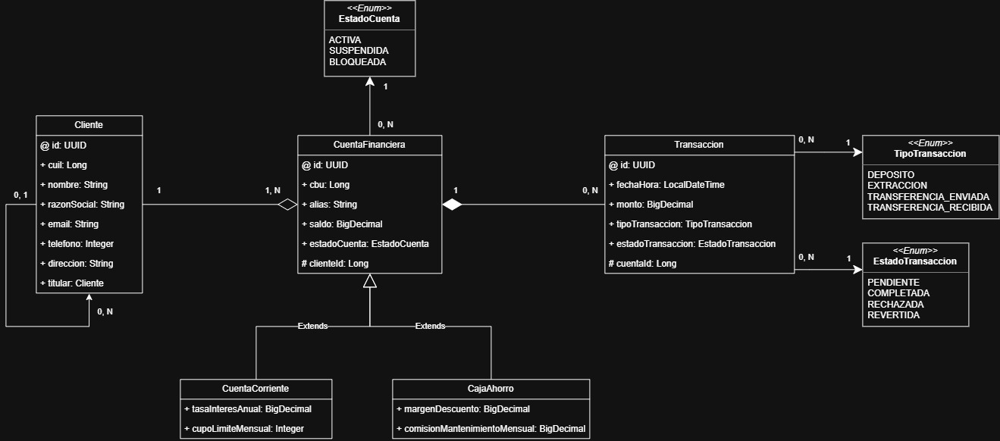

# Trabajo Practico - Desarrollo y Arquitecturas Avanzadas de Software

Trabajo Práctico de la materia **Desarrollo Avanzado de Arquitectura de Software**, desarrollado utilizando **Spring Boot** y **Spring Data JPA**.

El proyecto consiste en el diseño e implementación del modelo de dominio y persistencia de un **core financiero bancario**, encargado de gestionar clientes, cuentas financieras y transacciones.

----------

## Información del Proyecto


| Campo            | Información                                     |
| ---------------- | ----------------------------------------------- |
| **Materia**      | Desarrollo Avanzado de Arquitectura de Software |
| **Proyecto**     | Core Financiero Bancario                        |
| **Framework**    | Spring Boot                                     |
| **Lenguaje**     | Java                                            |
| **Persistencia** | Spring Data JPA / Hibernate                     |
| **Arquitectura** | Orientada a capas                               |
| **Estado**       | En desarrollo                                |

----------

## Contexto del Dominio

El sistema debe gestionar los movimientos operacionales de un banco mediante las siguientes entidades principales:

### Clientes

Representan a los usuarios del sistema.

Cada cliente posee información identificatoria:

- Nombre
- Razón Social    
- CUIL
- Email
- Teléfono
- Dirección
    
Un cliente puede ser titular de **una o más cuentas financieras**.

----------

### Cuentas Financieras

El banco ofrece diferentes productos financieros.

Todas las cuentas poseen:

- CBU único
-  Alias 
- Saldo operativo  
- Estado

Los posibles estados de una cuenta son:
```
ACTIVA
SUSPENDIDA
BLOQUEADA
```
El sistema contempla los tipos de cuentas:

#### Caja de Ahorro

Incluye:

- Tasa de interés anual
- Cupo límite de extracciones mensuales sin costo

#### Cuenta Corriente

Incluye:

- Margen de descubierto autorizado  
- Comisión de mantenimiento mensual

### Titularidad

La relación entre clientes y cuentas es **uno a muchos**:

- Un cliente puede ser titular de varias cuentas.    
- Una cuenta puede tener varios clientes como titulares o co-titulares.
 
----------

### Transacciones

Toda operación realizada sobre una cuenta debe quedar registrada.

Cada transacción contiene:

- Fecha y hora  
- Monto  
- Tipo de operación  
- Estado de procesamiento  

Tipos de transacción:
```
DEPOSITO
EXTRACCION
TRANSFERENCIA_ENVIADA
TRANSFERENCIA_RECIBIDA
```
Estados posibles:
```
PENDIENTE
COMPLETADA
RECHAZADA
REVERTIDA
```
----------

## Diagrama de Clases UML

El siguiente diagrama representa el modelo de dominio diseñado para el sistema:



----------

## Arquitectura del Proyecto

El proyecto sigue una arquitectura organizada por capas:

```
┌──────────────────────────┐
│       Controller         │
└────────────┬─────────────┘
             │
             ▼
┌──────────────────────────┐
│        Service           │
└────────────┬─────────────┘
             │
             ▼
┌──────────────────────────┐
│       Repository         │
└────────────┬─────────────┘
             │
             ▼
┌──────────────────────────┐
│       Base de Datos      │
└──────────────────────────┘
```
----------

## Tecnologías Utilizadas

- **Java**
- **Spring Boot**
- **Spring Data JPA**
-  **Hibernate**
- **Jakarta Persistence (JPA)**
- **JUnit**
- **Maven**
- **MySQL**    

----------

## Estado del Proyecto

El proyecto se encuentra actualmente **en desarrollo**, siguiendo las etapas establecidas en el trabajo práctico.

- Diseño del dominio
- Modelo de entidades
- Mapeo JPA
- Relaciones entre entidades
- Estrategia de herencia
- Auditoría
- Capa Repository
- Query Methods
- Capa Service
- Pruebas unitarias
    
----------

## Autores

- Nicolas Santiago Velasquez - **Ingeniería Informática — UNJu**
- Jose Maximiliano Flores - **Ingeniería Informática — UNJu**

Trabajo práctico académico correspondiente a la materia **Desarrollo Avanzado de Arquitectura de Software**.
